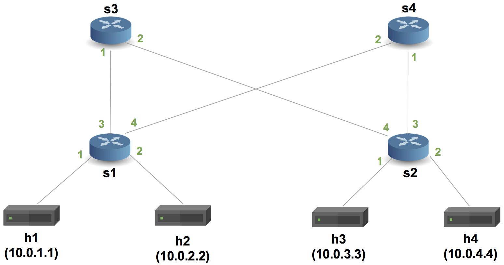

# hydra-artifact

# Instructions to Install 

This tutorial requires an Ubuntu 20.04 install. 

## Installing Hydra and OCaml

install opam 
```bash
apt install opam
```
initialize opam with the 4.14.0 OCaml compiler. 
```bash
opam init --compiler=4.14.0
```

### Install Petr4 from source 

clone the Petr4 repo
```bash
git clone git@github.com:verified-network-toolchain/petr4.git
```
install external dependencies
```bash
sudo apt-get install m4 libgmp-dev
```

install [p4pp](https://github.com/cornell-netlab/p4pp) from source
```bash
git clone git@github.com:cornell-netlab/p4pp.git
opam pin add p4pp <path to root of p4pp repo>
```

install coq and bignum
```bash
opam install coq
opam install bignum
```
build bundled dependencies
```bash
opam repo add coq-released https://coq.inria.fr/opam/released
opam pin add coq-vst-zlist https://github.com/PrincetonUniversity/VST.git
```
build and install with dune, inside the petr4 directory
```bash
opam install . --deps-only
opam exec -- dune build
dune install
```

### Install p4 tools
```bash
git clone https://github.com/jafingerhut/p4-guide
./p4-guide/bin/install-p4dev-v5.sh |& tee log.txt
```
This installs mininet and the bmv2 compiler. 

# Instructions to Install and Run Hydra 

install Hydra dependencies with opam inside the hydra directory
```bash
opam install . --deps-only
```

## Compiling and Linking the valley-free Indus Program with P4 source routing

Compile the valley-free Indus program (ends in tpc) with the basic_topology.json file from the topologies directory. This topology contains a single leaf switch for the purpose of this demo (mininet will install the same program to all switches)
```bash
dune exec -- tpc examples/valley-free/valley-free.tpc basic_topology.json
```

### Linking with the source routing program 

add these two lines to the top of the P4 program output in the generated_p4 directory
```OCaml
#include <v1model.p4> 
#define ETHERTYPE_CHECKER 0x5678;
```

copy the file to the p4_tutorials directory where the source routing example lives in `exercises/valley_free/hydra`

## Running the source routing example in mininet

run `make` to run mininet and start the example with the following topology



You can run commands in mininet either by getting a terminal for each host (e.g. `xterm h1 h4`) or within the mininet console pre-pending the name of the host to the command (e.g. `h1 python3 receive.py`). If running inside the mininet console, tcpdump can be used to view the packet on h4. 


