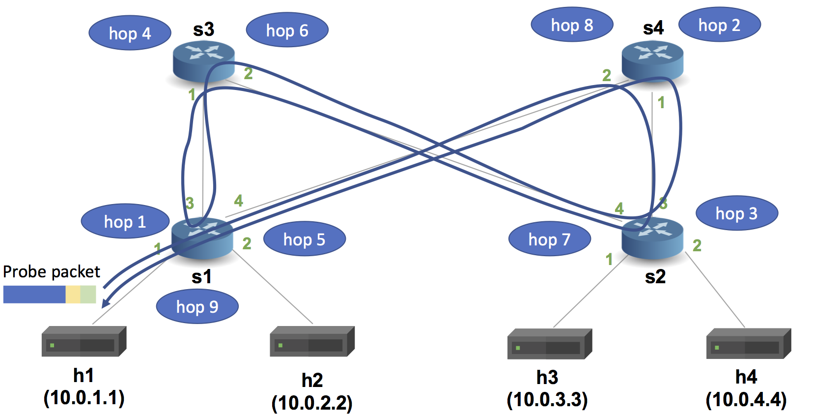

# Implementing Link Monitoring

## Introduction

The objective of this exercise is to write a P4 program that enables
a host to monitor the utilization of all links in the network. This
exercise builds upon the basic IPv4 forwarding exercise so be sure
to complete that one before attempting this one. Specifically, we
will modify the basic P4 program to process a source routed probe
packet such that it is able to pick up the egress link utilization
at each hop and deliver it to a host for monitoring purposes.

Our probe packet will contain the following three header types:
```
// Top-level probe header, indicates how many hops this probe
// packet has traversed so far.
header probe_t {
    bit<8> hop_cnt;
}

// The data added to the probe by each switch at each hop.
header probe_data_t {
    bit<1>    bos;
    bit<7>    swid;
    bit<8>    port;
    bit<32>   byte_cnt;
    time_t    last_time;
    time_t    cur_time;
}

// Indicates the egress port the switch should send this probe
// packet out of. There is one of these headers for each hop.
header probe_fwd_t {
    bit<8>   egress_spec;
}
```

We will use the pod-topology for this exercise, which consists of
four hosts connected to four switches that are wired up as they
would be in a single pod of a fat tree topology.



In order to monitor the link utilization our switch will maintain
two register arrays:
* `byte_cnt_reg` - counts the number of bytes transmitted out of
  each port since the last probe packet was transmitted out of
  the port.
* `last_time_reg` - stores the last time that a probe packet was
  transmitted out of each port.

Our P4 program will be written for the V1Model architecture implemented
on P4.org's bmv2 software switch. The architecture file for the V1Model
can be found at: /usr/local/share/p4c/p4include/v1model.p4. This file
desribes the interfaces of the P4 programmable elements in the architecture,
the supported externs, as well as the architecture's standard metadata
fields. We encourage you to take a look at it.

> **Spoiler alert:** There is a reference solution in the `solution`
> sub-directory. Feel free to compare your implementation to the
> reference.

## Step 1: Run the (incomplete) starter code

The directory with this README contains a skeleton P4 program,
`link_monitor.p4`, which implements basic IPv4 forwarding, as well
as source routing of the probe packets. Your job will be to
extend this skeleton program to fill out the fields in the probe
packet.

Before that, let's compile and test the incomplete `link_monitor.p4`
program:

1. In your shell, run:
   ```bash
   make run
   ```
   This will:
   * compile `link_monitor.p4`, and
   * start the pod-topo in Mininet and configure all switches with
   the `link_monitor.p4` program + table entries, and
   * configure all hosts with the commands listed in
   [pod-topo/topology.json](./pod-topo/topology.json)

2. You should now see a Mininet command prompt. Open two terminals
on `h1`:
   ```bash
   mininet> xterm h1 h1
   ```
3. In one of the xterms run the `send.py` script to start sending
probe packets every second. Each of these probe packets takes the
path indicated in link-monitor-topo.png.
   ```bash
   ./send.py
   ```
4. In the other terminal run the `receive.py` script to start
receiving and parsing the probe packets. This allows us to monitor
the link utilization within the network.
   ```bash
   ./receive.py
   ```
The reported link utilization and the switch port numbers will
always be 0 because the probe fields have not been filled out yet.

5. Run an iperf flow between h1 and h4:
   ```bash
   mininet> iperf h1 h4
   ```
6. Type `exit` to leave each xterm and the Mininet command line.
   Then, to stop mininet:
   ```bash
   make stop
   ```
   And to delete all pcaps, build files, and logs:
   ```bash
   make clean
   ```

The measured link utilizations will not agree with what iperf reports
because the probe packet fields have not been populated yet. Your
goal is to fill out the probe packet fields so that the two
measurements agree.

### A note about the control plane

A P4 program defines a packet-processing pipeline, but the rules
within each table are inserted by the control plane. When a rule
matches a packet, its action is invoked with parameters supplied by
the control plane as part of the rule.

In this exercise, we have already implemented the control plane
logic for you. As part of bringing up the Mininet instance, the
`make run` command will install packet-processing rules in the tables of
each switch. These are defined in the `sX-runtime.json` files, where
`X` corresponds to the switch number.

**Important:** We use P4Runtime to install the control plane rules. The
content of files `sX-runtime.json` refer to specific names of tables, keys, and
actions, as defined in the P4Info file produced by the compiler (look for the
file `build/link_monitor.p4.p4info.txt` after executing `make run`). Any
changes in the P4 program that add or rename tables, keys, or actions
will need to be reflected in these `sX-runtime.json` files.

## Step 2: Implement Link Monitoring Logic

The `link_monitor.p4` file contains a skeleton P4 program with key pieces of
logic replaced by `TODO` comments. Your implementation should follow
the structure given in this file---replace each `TODO` with logic
implementing the missing piece.

Here are a few more details about the design:

**Parser**
* The parser has been extended support parsing of the source routed probe packets.
The parser is the most complicated part of the design so spend a bit of time
reading over it. Note that it does not contain any TODO comments so there is
nothing you need to change here.
* To parse the probe packets, we use the `hdr.probe.hop_cnt` to determine how many
hops the packet has traversed prior to reaching the switch. If this is the first
hop then there will not be any `probe_data` in the packet so we skip that state
and transition directly to the `parse_probe_fwd` state. In the `parse_probe_fwd`
state, we use the `hdr.probe.hop_cnt` field to figure out which `egress_spec`
header field to use to perform forwarding and we save that port value into a
metadata field which is subsequently used to perform forwarding.

**Ingress Control**
* The ingress control block looks very similar to the `basic` exercise. The only
difference is that the `apply` block contains another condition to forward probe
packets using the `egress_spec` field extracted by the parser. It also increments
the `hdr.probe.hop_cnt` field.

**Egress Control**
* This is where the interesting stateful processing occurs. It uses the
`byte_cnt_reg` register to count the number of bytes that have passed through each
port since the last probe packet passed through the port.
* It adds a new `probe_data` header to the packet and filld out the `bos`
(bottom of stack) field, as well as the `swid` (switch ID) field.
* TODO: your job is to fill out the rest of the probe packet fields in order to
ensure that you can properly measure link utilization.

**Deparser**
* Simply emits all headers in the correct order.
* Note that emitting a header stack will only emit the headers within the stack
that are actually marked as valid.

## Step 3: Run your solution

Follow the instructions from Step 1. This time, the measured link
utilizations should agree with what `iperf` reports.

### Troubleshooting

There are several problems that might manifest as you develop your program:

1. `link_monitor.p4` might fail to compile. In this case, `make run` will
report the error emitted from the compiler and halt.

2. `link_monitor.p4` might compile but fail to support the control plane
rules in the `s1-runtime.json` through `s4-runtime.json` files that
`make run` tries to install using P4Runtime. In this case, `make run` will
report errors if control plane rules cannot be installed. Use these error
messages to fix your `link_monitor.p4` implementation.

3. `link_monitor.p4` might compile, and the control plane rules might be
installed, but the switch might not process packets in the desired
way. The `logs/sX.log` files contain detailed logs that describing
how each switch processes each packet. The output is detailed and can
help pinpoint logic errors in your implementation.

#### Cleaning up Mininet

In the latter two cases above, `make run` may leave a Mininet instance
running in the background. Use the following command to clean up
these instances:

```bash
make stop
```

### Food For Thought

Now that you've implemented this basic monitoring framework can you
think of ways to leverage this information about link utilization
within the core of the network? For instance, how might you use this
data, either at the hosts or at the switches, to make real-time
load-balancing decisions?

## Relevant Documentation

The documentation for P4_16 and P4Runtime is available [here](https://p4.org/specs/)

All excercises in this repository use the v1model architecture, the documentation for which is available at:
1. The BMv2 Simple Switch target document accessible [here](https://github.com/p4lang/behavioral-model/blob/master/docs/simple_switch.md) talks mainly about the v1model architecture.
2. The include file `v1model.p4` has extensive comments and can be accessed [here](https://github.com/p4lang/p4c/blob/master/p4include/v1model.p4).